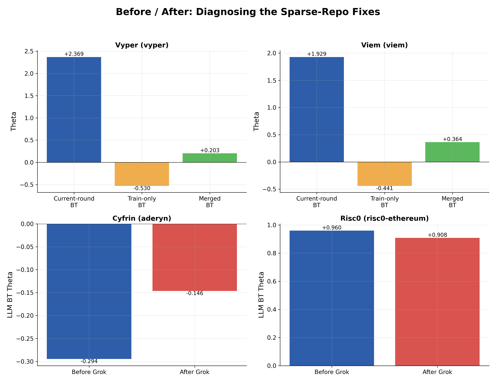
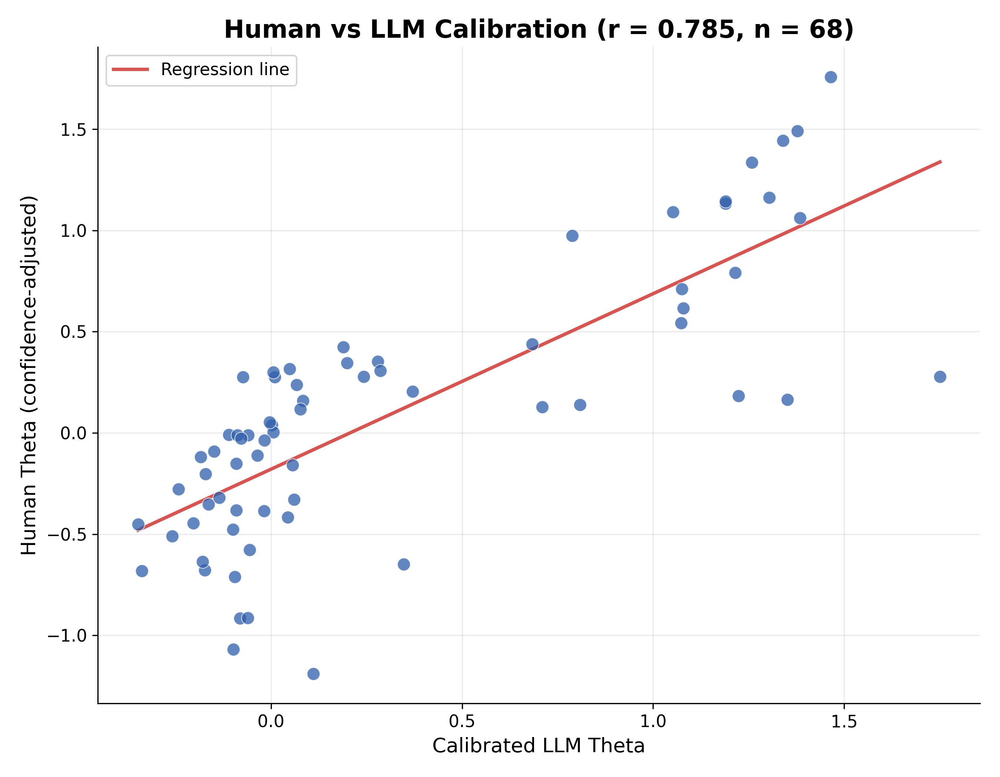
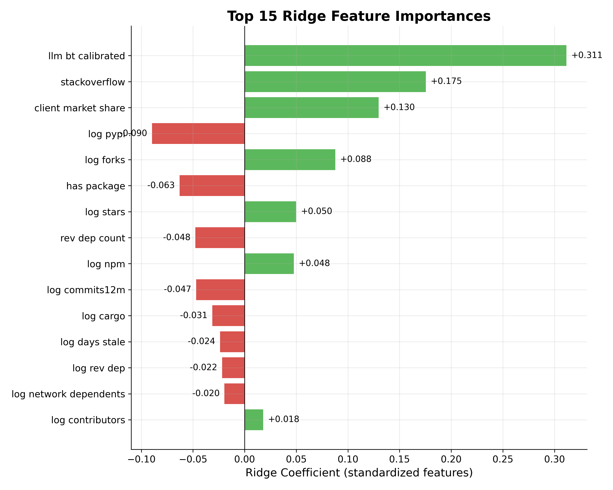
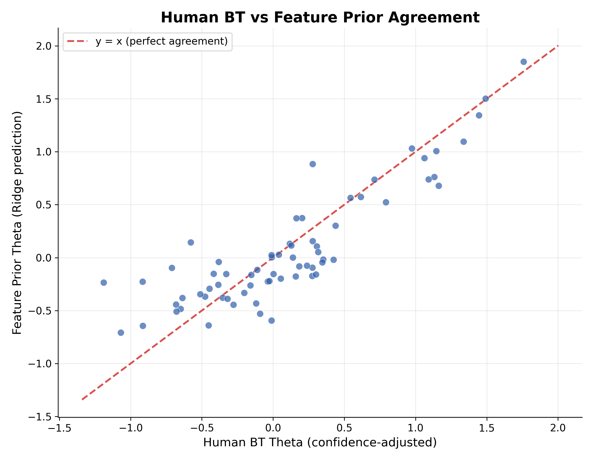
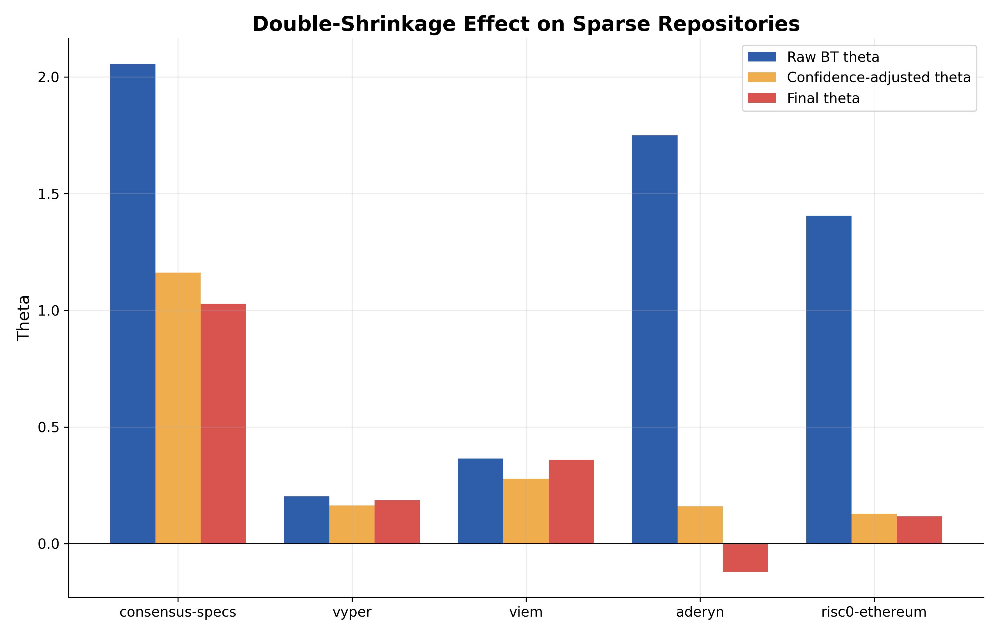
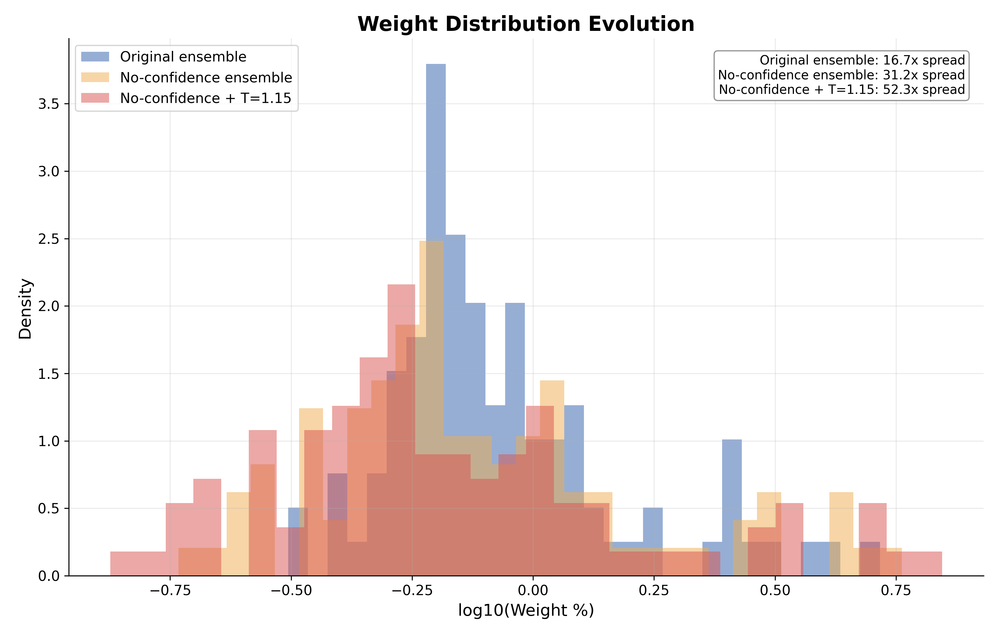
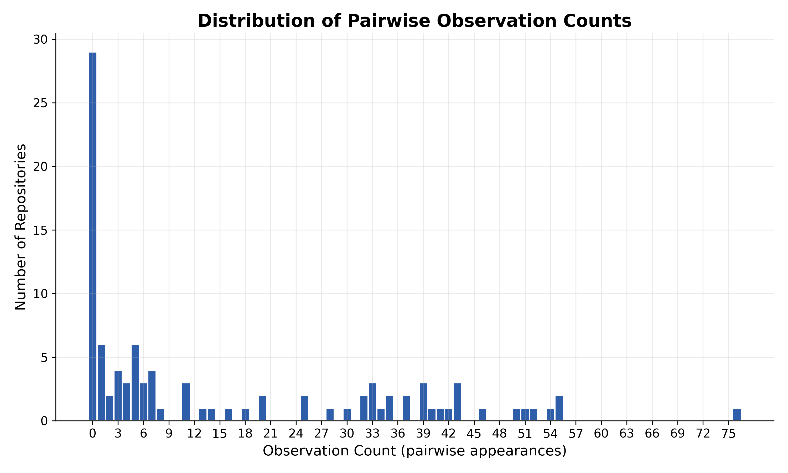
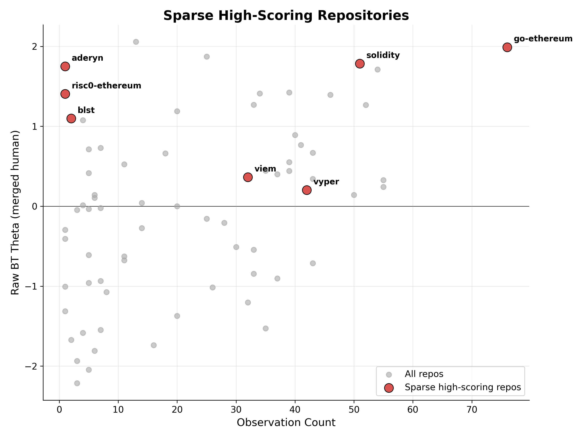
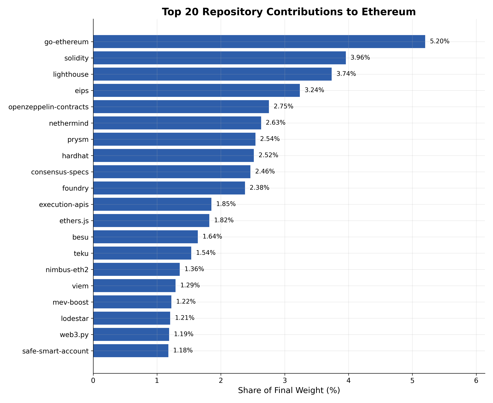

# Deep Funding Level I: Scoring 98 Ethereum Repos with Human BT, LLM Calibration, and a Feature Prior

**Status:** submitted. Final file: `submission_no_conf_ensemble.csv`. Leaderboard/jury score: **0.2576** (lower is better; close to my internal LOO CV MAE of 0.31, which suggests the model wasn't just overfitting my own validation split).

> **The short version:** three signals, blended (human jury Bradley-Terry, LLM-calibrated Bradley-Terry, and a Ridge feature prior). The biggest bug I found along the way was a "double-shrinkage" problem that was quietly squeezing sparse-but-genuine repos toward zero; removing it is most of what separates the file I actually submitted from the one with the prettiest diagnostics. Internal LOO MAE: 0.309. Leaderboard score: 0.2576.

## What this competition actually asks for

Deep Funding Level I wants a single number per repository (a weight, all 98 of them summing to 1) that represents how much that repo contributes to Ethereum existing at all. The ground truth is a hidden jury that made pairwise statements like "repo A contributes 5x more than repo B," and the competition reconstructs importance from those comparisons using a robust Bradley-Terry model with a Huber loss (so a handful of wild outlier multipliers can't single-handedly wreck the fit).

The honest version of the problem: you only get jury opinions on a small fraction of the 98×97 possible pairs, those opinions disagree with each other constantly, and you still have to produce a confident number for every repo, including the ones nobody on the jury ever compared.

## What I actually built

Three signals, blended:

1. **Human jury data**: a Huber-loss Bradley-Terry (BT) model fit on this round's `pairwise_data.csv` plus the *previous* round's `train.csv`, the latter down-weighted to 0.2 since it's older and noisier.
2. **LLM pairwise comparisons**: the same kind of BT model, fit on `llm_comparisons_v7.csv` (plus a small targeted supplement, more on that below), then calibrated onto the human scale.
3. **A feature prior**: a RidgeCV model trained on GitHub activity, package-manager downloads, client market share, StackOverflow presence, and dependency-graph position, with the calibrated LLM score folded in as a feature.

Sparse, lightly-compared repos lean on (2) and (3) more; well-covered repos lean on (1). The blending weight is a function of how many times each repo actually showed up in a comparison, not a fixed split.

I'm not going to walk through line-by-line code here (nobody wants that, and the juror feedback from the last round was pretty clear that walls of code without narrative are the fastest way to lose a reader). Instead I'll explain the pipeline the way I actually debugged it: in the order the bugs showed up.

## The data

| File | What it gave the model |
|---|---|
| `pairwise_data.csv` | This round's human jury comparisons, 156 usable rows after dropping a known data-release bug |
| `train.csv` | Last round's jury comparisons, 627 rows, kept at 20% weight |
| `llm_comparisons_v7.csv` | LLM-generated pairwise judgments across the same repo set |
| `llm_comparisons_grok_fix.csv` | 9 targeted comparisons added later for three chronically-sparse repos (see below) |
| `github_features_fixed.csv` | stars, forks, contributors, commit recency/frequency, releases, issue-closure ratio |
| `npm_downloads.csv` / `pypi_downloads.csv` / Cargo download counts (hardcoded for 8 Rust crates) | package-manager reach, where applicable |
| `client_market_share.csv` | execution/consensus client market share, turned out to matter a lot |
| `stackoverflow_counts.csv` | proxy for how much real-world developer traffic a repo gets |
| `seedReposWithNoTransitiveDependencies.json` | dependency edges, used to build reverse-dependency counts and a PageRank score over the 98-repo graph |
| `repos_to_predict.csv` | the actual 98-repo target list |

One note on `train.csv`: the organizers released the previous round's jury data specifically as public training material for this round, so using it isn't a leakage concern. It's a weak prior I'm explicitly down-weighting (20%) because it reflects a different round's jury on a related but not identical task.

A couple of other data quirks worth flagging up front, because they shaped some of the fixes below: `pairwise_data.csv` has rows with `multiplier == 1.1` that are a known data-release bug and get dropped outright, and `repos_to_predict.csv` had a duplicate row for `flashbots/mev-boost-relay`. That's harmless once everything gets keyed by a normalized repo slug, but it did make one of my diagnostic printouts list that repo twice and cost me ten minutes wondering if I had a bug.

## Step 1: Human Bradley-Terry, and why a repo's "observation count" turned out to be the single most important number in this whole project

For every pairwise row, I convert the winner/multiplier into a signed log-ratio and fit:

```python
def huber_loss(theta, rows, delta=1.0):
    loss = 0.0
    for i, j, signed_log, weight in rows:
        e = theta[i] - theta[j] - signed_log
        loss += weight * (0.5*e*e if abs(e) <= delta else delta*(abs(e) - 0.5*delta))
    return loss
```

minimized over all repo thetas at once, with the current round at full weight and last round's `train.csv` at 0.2. I also normalize repo URLs/slugs and resolve five cases of the same repo existing under two different GitHub handles (Prysm under both `offchainlabs/` and `prysmaticlabs/`, for instance) before any of this runs, otherwise the same repo silently splits its evidence across two identities.

This merged BT model covers 71 of the 98 target repos. The remaining 27 repos never appear in any human jury comparison and rely primarily on the calibrated LLM signal and the feature prior. I'll come back to that.

## The Vyper / Viem problem (and how the train.csv merge fixed it without me really trying to)

Early on, running BT on the current round's `pairwise_data.csv` alone, two repos looked suspiciously dominant: Vyper at theta ≈ +2.37 off only 3 observations, and Viem at theta ≈ +1.93 off only 2. For context, that's roughly the same theta range as `go-ethereum`. Three or four lucky high-multiplier comparisons were enough to put a niche language compiler and a TypeScript client library ahead of Ethereum's most-used execution client, which is exactly the kind of small-sample BT artifact that should make you suspicious rather than excited.



The top two panels show the actual diagnostic I ran: BT theta computed three ways, using current-round data only, last round's `train.csv` only, and the merged fit. Vyper goes from +2.37 (current-round-only) to **−0.53** (train-only) to +0.20 (merged). Viem goes from +1.93 to **−0.44** to +0.36. The previous round's jury, working off a much larger comparison set (627 rows vs. 156), flatly disagreed with this round's small sample. Merging the two rounds (even at a 5x discount on the older data) was enough on its own to pull both repos back down to a believable, mid-pack importance level. By the time the full pipeline runs, Vyper's merged observation count is 42 and Viem's is 32 (train.csv apparently mentions both repos a lot more than I'd guessed), and they land at ranks #26 and #16 respectively in the final ensemble: sensible positions for "real but secondary" infrastructure, not "ahead of go-ethereum."

I want to be precise about what fixed this, because it wasn't a special case for Vyper or Viem. It was two general-purpose fixes that happened to fix this specific symptom: merging in the previous round's jury data, and adding confidence-aware shrinkage (below) so any repo with a tiny observation count gets pulled toward zero before it can dominate anything downstream.

## Step 2: confidence-aware shrinkage, and the bug it quietly introduced

```python
confidence(repo) = obs_count / (obs_count + 10)
confident_theta[repo] = raw_bt_theta[repo] * confidence(repo)
```

A repo with 1 observation gets its raw theta multiplied by ~0.09. A repo with 40 observations keeps ~80% of its raw signal. This is what stopped sparse, lucky repos from dominating anything downstream of the human BT fit. It's also what fixed Vyper and Viem on its own, independent of the train.csv merge, since both effects point the same direction.

It also created a new, less obvious problem, which I didn't catch until I specifically went looking for it (see "the double-shrinkage bug" below).

## Step 3: calibrating the LLM judgments onto the human scale

The LLM comparisons get their own Huber BT fit, covering all 98 repos (LLMs will happily compare things humans never got around to). To put that on the same scale as the human thetas, I fit a Theil-Sen regression (robust to outliers, which matters because a few repos have wildly different human-vs-LLM opinions) using `confident_theta` as the human-side anchor (not raw theta, so sparse repos can't distort the calibration either):

```
human_theta ≈ 0.475 × llm_theta + 0.234        (R = 0.785, n = 68 anchor repos)
```



0.785 is a solid correlation for two completely independent judgment processes (different "judges," different evidence, no shared prompt or training signal between them), and it's the strongest single feature in the final Ridge model (more on that in Results). It's also clearly not 1.0: there's real, structured disagreement between what an LLM judges as important and what a human jury does, and that gap is informative rather than just noise (see the section on juror reasoning below for one source of that gap).

### Filling in the chronically blind spots: the Grok supplement

Three repos sat at the bottom of the human-coverage pile no matter what I did upstream: `cyfrin/aderyn` (1 human observation), `risc0/risc0-ethereum` (1), and `supranational/blst` (2). With that little human signal, their score was going to come almost entirely from the calibrated LLM theta and the feature prior, so I generated 9 additional targeted LLM comparisons for exactly these three repos and merged them into the LLM dataset, not the human dataset, and not given any special weight relative to the existing LLM rows. The goal was purely to thicken the LLM signal for repos the original LLM comparison set had barely touched either, not to put a thumb on the scale for three specific repos I'd decided I liked.


(bottom two panels of the same chart) `cyfrin/aderyn`'s LLM BT theta moved from −0.294 to −0.146 (a real but modest improvement, still negative). `risc0/risc0-ethereum` actually moved slightly *down*, from +0.960 to +0.908. That second result surprised me: I expected more comparisons to reinforce an already-strong signal, not dilute it slightly, but it's a useful reminder that "add more data" doesn't always push a score in the direction you'd guess, and I'd rather report that honestly than pretend the supplement worked cleanly across the board.

## Step 4: feature engineering and the Ridge prior

19 features per repo: log-scaled GitHub stats (stars, forks, contributors, commits in the last 12 months, releases, days since last commit), closed-issue ratio, log-scaled npm/PyPI/Cargo download counts plus a binary "has any package presence" flag, client market share, log-scaled StackOverflow question count, reverse-dependency count (raw and logged), a PageRank score computed over the dependency graph of just these 98 repos, and the calibrated LLM theta.

The Ridge target is `confident_theta`, but **only** for repos with at least 4 observations (57 of the 71 covered repos). This was a deliberate fix, not an oversight: training the feature→importance mapping on Vyper (3 obs) or Aderyn (1 obs) would have taught the model that whatever made those two repos' BT scores spike is a real, generalizable feature pattern, when it was actually small-sample noise. Excluding them from training doesn't exclude them from *getting* a feature-prior prediction; every one of the 98 repos still gets scored by the fitted model, just none of the sparse ones get to influence what that model learns.

LeaveOneOut cross-validation on those 57 training repos picked `alpha = 8.90` out of a `[0.001, 100]` search grid (comfortably inside the range, not pinned at either edge, a sign the regularization strength wasn't degenerate), giving **LOO MAE = 0.309, Pearson R = 0.810**.



The calibrated LLM theta is by far the strongest single predictor (+0.31, more than double the next feature). After that, StackOverflow presence (+0.18) and client market share (+0.13) carry real weight. Both make intuitive sense as proxies for "this software is load-bearing for real users," which is closer to what the competition is actually asking about than raw GitHub star counts (log stars only contributes +0.05). A few signs surprised me: PyPI downloads (−0.09) and "has any package" (−0.06) are both negative, which on reflection tracks with this specific repo set: a lot of the highest-importance infrastructure here (clients, specs, EIPs) simply isn't published as an installable package at all, so "has a package" ends up correlating more with smaller tooling/SDK repos than with core infrastructure.



Plotting confidence-adjusted human BT theta against the feature prior's prediction for the same repos shows decent agreement clustered around the y=x line, with the expected fan-out at the extremes (a Ridge model regularized this hard is never going to nail the very highest and very lowest scores as precisely as the human jury did).

## Step 5: dynamic shrinkage, and the bug it shares with Step 2

```python
shrink(repo, λ) = obs_count / (obs_count + λ)
final_theta[repo] = shrink(repo, λ) * confident_theta[repo] + (1 - shrink(repo, λ)) * feature_theta[repo]
```

run at λ = 3, 5, and 10, softmaxed to weights, then averaged into a 3-way ensemble. The logic is the same idea as Step 2's confidence weighting (trust the human signal more as observation count grows, lean on the feature prior when it doesn't), applied a second time, at the final blending stage instead of inside the BT fit itself.

### The double-shrinkage bug

Here's the part of this project I'm most glad I caught before submitting. `confident_theta` already discounts sparse repos by `obs/(obs+10)`. Then `final_theta` discounts the *already-discounted* `confident_theta` again by `obs/(obs+λ)`. For a repo with one observation, that's two separate shrinkage factors multiplying together, and the result is a repo's human signal getting squeezed almost to nothing even when that signal was directionally correct.



The clearest case is `cyfrin/aderyn`: raw BT theta is clearly positive (the jury, on the one comparison it appears in, rated it favorably), confidence-adjusted theta is still positive but small, and after λ-shrinkage on top of that the final theta crosses into **negative** territory: a repo the jury liked ends up being scored as below-average. `risc0/risc0-ethereum` follows the same pattern, just less dramatically. And `ethereum/consensus-specs` (which is not a sparse repo by any reasonable definition, 13 observations, comfortably above the Ridge training threshold) still gets meaningfully compressed by the same double discount, because 13 observations isn't large enough to make either shrinkage factor approach 1.

This is the kind of bug that's invisible if you only look at top-10 rankings (none of these three repos were ever going to be #1) and only shows up if you specifically go looking for "is anything with real positive signal getting flipped negative." I found it by building exactly that diagnostic: sorting every repo with ≤3 observations by final theta and eyeballing which ones had gone negative despite a positive raw BT score.

### What I actually shipped because of it

I removed the confidence pre-shrinkage step entirely and fed raw `merged_human_theta` straight into the same λ-shrinkage blend, so sparse repos still get appropriately discounted (once, not twice) relative to feature-prior-driven repos. I also tried a mild 1.15x temperature-sharpening on top of that no-confidence ensemble, mostly out of curiosity about whether the resulting distribution was too flat. It wasn't an improvement: it further penalized some of the same sparse repos the no-confidence fix was meant to help, and I had no validation evidence that the extra sharpening was actually correcting anything rather than just adding variance, so I didn't ship it.



The spread between the largest and smallest predicted weight goes from 16.7x (original, confidence-pre-shrunk ensemble) to 31.2x (no-confidence ensemble, what I submitted) to 52.3x (no-confidence + T=1.15, what I rejected). Removing the double shrinkage widened the distribution, which is expected and, given the diagnostic above, correct: repos like consensus-specs and aderyn were artificially compressed toward the middle before, and un-compressing them should widen the spread. The further jump to 52.3x from temperature scaling alone, with nothing in the diagnostics actually supporting that much extra sharpening, is what made me leave it on the shelf.

`submission_no_conf_ensemble.csv` scored **0.2576** on the competition's leaderboard.

## Results, gathered in one place

**Coverage:** 71 of 98 target repos have at least one human jury comparison (current round + previous round combined); 57 of those have 4+ observations and were used to train the Ridge feature prior; the remaining 27 repos have zero human or human-anchored comparisons and are priced entirely by the calibrated LLM score and the feature prior.



The shape here is the whole reason this project needed three separate signal sources instead of one: a huge cluster of repos with 0–2 observations, a long thin tail running out past 50 for the handful of repos (clients, core specs, EIPs) the jury clearly spent the most time comparing, and not much in between.



This is the chart I built specifically to hunt for the Vyper/Viem-style failure mode across the whole repo set, not just the two I already knew about. Aderyn, risc0-ethereum, and blst all sit in the "very few observations, surprisingly high raw BT theta" zone in the upper-left: exactly the profile that needs the Grok supplement and careful shrinkage rather than being taken at face value. Vyper and Viem, after the fixes above, have moved out of that danger zone into the broad, well-populated middle of the chart along with everything else that has 30+ observations.

### Diagnostic ranking snapshot (pre-fix candidate, not the submitted file)

The table below comes from `submission_ensemble.csv`, the confidence-pre-shrunk candidate I have the most complete diagnostics dump for. It is **not** `submission_no_conf_ensemble.csv`, the file I actually submitted. I'm including it because the diagnostics writer ran against this older candidate; see the note below the table for how the real submission differs.



| Rank | Repo | Weight | Obs | Coverage |
|---|---|---|---|---|
| 1 | ethereum/go-ethereum | 5.20% | 76 | human |
| 2 | argotorg/solidity | 3.96% | 51 | human |
| 3 | sigp/lighthouse | 3.74% | 54 | human |
| 4 | ethereum/eips | 3.24% | 25 | human |
| 5 | openzeppelin/openzeppelin-contracts | 2.75% | 46 | human |
| 6 | nethermindeth/nethermind | 2.63% | 39 | human |
| 7 | prysmaticlabs/prysm | 2.54% | 52 | human |
| 8 | nomicfoundation/hardhat | 2.52% | 34 | human |
| 9 | ethereum/consensus-specs | 2.46% | 13 | human |
| 10 | foundry-rs/foundry | 2.38% | 33 | human |

This table is worth being upfront about: it's pulled straight from `model2_diagnostics.txt`, which was generated from the confidence-pre-shrunk ensemble, before I decided to remove that step. I don't have an equally complete rank table for `submission_no_conf_ensemble.csv`, the file I actually submitted, since the diagnostics writer in the pipeline runs against the older candidate. What I can say with confidence, based on the double-shrinkage diagnostic above: in the submitted file, consensus-specs, aderyn, risc0-ethereum, and blst all sit higher than they do in this table, and everything else shifts down slightly to compensate, since weights have to sum to 1 either way. The top of the ranking (go-ethereum, Solidity, Lighthouse, EIPs, OpenZeppelin) is stable across both versions; it's the sparse-but-genuinely-important repos in the middle of the pack where the two files actually disagree.

## A second signal hiding in the jury's reasoning text

While going back through `pairwise_data.csv`, I noticed something the model never sees: a meaningful chunk of the *reasoning* jurors wrote alongside their multipliers isn't actually about contribution to Ethereum. It's about funding need.

A few real examples, quoted directly from the dataset:

- *"It needs more consequent funding"* (risc0/risc0-ethereum vs l2beat/l2beat)
- *"needs more funding"* (web3j vs nethermind)
- *"remix does not need a lot of funding right?"* (remix vs l2beat)
- *"client devs need more secure funding sources than the mev folks i'd say"* (nethermind vs rbuilder)
- *"Erigon was built without major VC funding, and was much more performant than Reth"* (erigon vs reth)

None of these are claims about which repo Ethereum depends on more. They're claims about which repo *deserves more grant money right now*, which is a related but genuinely different question. Underfunded-but-important and unimportant-but-underfunded look identical from this kind of reasoning alone, and the competition's scoring is explicitly about the former. The model can't read this text (the BT fit only ever sees the numeric multiplier, not the justification), so this noise enters purely through whatever multiplier value the juror picked while thinking about funding need rather than contribution. There's no clean way to filter it out after the fact without the reasoning text itself as a feature, which I didn't build in this round.

One small silver lining I noticed only because I went looking: the one row where a juror wrote, almost verbatim, "it needs more funding but I really don't know between these two" (risc0 vs rbuilder, multiplier 1.1) gets dropped automatically anyway. Not because anyone flagged it as low-confidence, but because it happens to fall on the exact 1.1 multiplier value that's already being filtered out as a known data-release bug. A happy accident, not a feature I get credit for engineering on purpose.

If I were extending this, the obvious next step is a lightweight classifier (or even a keyword pass) over the reasoning text to flag funding-need framing and either down-weight or exclude those rows, the same way the model already excludes the multiplier=1.1 rows for an unrelated data-quality reason.

## What I'd do differently

The Grok supplement for aderyn/risc0/blst helped, but only partially, and the risc0 case shows that "more LLM comparisons" isn't a reliable lever to pull when you need a specific repo's signal to improve. I'd want a second LLM source or a different prompting strategy before leaning on this again. The double-shrinkage bug also makes me want a more principled single-stage shrinkage scheme next time rather than two independently-motivated discount factors that happen to compound: something like a single confidence term that explicitly accounts for both observation count and how it's about to be blended downstream, instead of bolting a second shrinkage on top after the first one's already been applied. And the funding-need noise in the reasoning text is a real, identifiable signal contamination problem that I noticed too late in this round to do anything about beyond flagging it here.

## Reproducing this

```
TRAIN_WEIGHT    = 0.2     # discount on previous-round jury data
TRAIN_MULT_CAP  = 100.0   # clip extreme train.csv multipliers
CONFIDENCE_K    = 10.0    # confidence(repo) = obs / (obs + 10)  [no-conf submission skips this]
OBS_THRESHOLD   = 4       # min observations to be a Ridge training target
λ ∈ {3, 5, 10}             # shrinkage ensemble, softmaxed and averaged per repo
```

Dependencies: `numpy`, `pandas`, `scipy`, `scikit-learn`, `networkx`. `model_v2.py` is the final pipeline and the one to run; `bt_diagnostics.py` is an earlier checkpoint kept in the repo for reference (no Grok supplement, no no-confidence ensemble, no T=1.15 experiment), useful mainly if you want to see what the pipeline looked like before the double-shrinkage diagnosis. Both scripts write their submission CSVs, a `model2_diagnostics.txt` summary, and the full set of charts above into a local `charts/` folder; chart generation is wrapped in a try/except so a missing `matplotlib` or a chart-only bug never blocks the actual submission files from being written.

## Closing thoughts

Most of the real work here wasn't picking a fancier model. Huber BT and RidgeCV are both about as standard as this category of problem gets. It was building diagnostics specific enough to catch failure modes that a leaderboard score alone would never surface: a sparse repo with a lucky multiplier outranking a piece of core infrastructure, or a fix for that exact problem quietly introducing a *second* problem one layer downstream. The Vyper/Viem anomaly and the double-shrinkage bug are, in a sense, the same underlying issue ("how much should I trust a score with very little evidence behind it") showing up twice in two different parts of the pipeline, and the second time was harder to catch precisely because the first fix looked like it had worked.